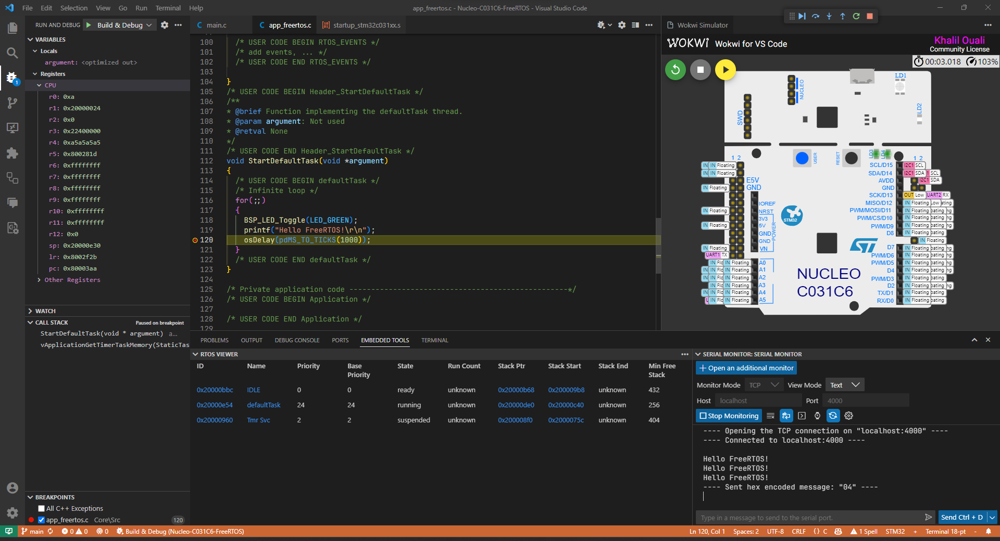

# FreeRTOS / HAL on STM32 Nucleo64 C031C6 with Wokwi Simulation

## Description

- Framework: `FreeRTOS / HAL`
- Toolchain: `ARM GCC`
- Builder: `Make`
- Configuration: `STM32CubeMX`
- Board: `Nucleo C031C6`
  - MCU: `STM32C031C6`
    - CPU: `ARM Cortex-M0+`
    - Clock: `4-48 MHz`
    - RAM: `12 KB`
    - Flash: `32 KB`
- IDE: `VSCode`
- Simulation: `Wokwi`
- CI/CD: `GitHub Actions` + `Wokwi CI`

## Prerequisites

- [Arm GNU Toolchain](https://developer.arm.com/downloads/-/arm-gnu-toolchain-downloads) for compilation
- [GNU Make](https://www.gnu.org/software/make/) ([Make for Windows](https://gnuwin32.sourceforge.net/packages/make.htm)) for building
- [STM32CubeMX](https://www.st.com/en/development-tools/stm32cubemx.html) for configuration / code generation

## Recommended usage

1. Clone this repo
2. Open in [VSCode](https://code.visualstudio.com/)
3. Install the `[recommended extensions](.vscode/extensions.json)
4. Run VSCode debugger on `Build & Debug` task

VSCode will automatically build the project, start the Wokwi simulator and attach the debugger.
The simulation will be paused for the debugger to attach. Once ready, you can continue by clicking ⏯️ or pressing `F5`.

## Alternate usage

### Build

Run `make` from terminal or use the [Makefile Tools](https://marketplace.visualstudio.com/items?itemName=ms-vscode.makefile-tools) extension.

By default the build will be in debug mode. To build for release, set `DEBUG=0` in the [Makefile](Makefile).

### Simulate

1. Install [Wokwi extension](https://marketplace.visualstudio.com/items?itemName=wokwi.wokwi-vscode) for VSCode
2. Command Palette -> `Wokwi: Request a New License` and get license from wokwi.com
3. Command Palette -> `Wokwi: Select Config File` and select `Wokwi/wokwi.toml`
4. Command Palette -> `Wokwi: Start Simulator`

Relevant files:

- [`Wokwi/wokwi.toml`](Wokwi/wokwi.toml) - See [documentation](https://docs.wokwi.com/vscode/project-config).
- [`Wokwi/diagram.json`](Wokwi/diagram.json) - See [diagram format](https://docs.wokwi.com/diagram-format) and [board details](https://docs.wokwi.com/parts/board-st-nucleo-c031c6).

Notes:

- You will see the serial output directly in the Wokwi terminal.
- The simulation only runs while the Wokwi tab is visible in VSCode.
- The simulation requires an internet connection. You can get a license for offline use.
- You can add more components to the simulation by editing [`Wokwi/diagram.json`](Wokwi/diagram.json) and restarting the simulator.

### Debug

1. Install [C/C++ extension](https://marketplace.visualstudio.com/items?itemName=ms-vscode.cpptools) for VSCode
2. Start simulation
3. Run VSCode debugger on `Debug` task

## Further usage

### Serial communication

1. Install [Serial Monitor extension](https://marketplace.visualstudio.com/items?itemName=ms-vscode.vscode-serial-monitor) for VSCode
2. Command Palette -> `Serial Monitor: Focus on Serial Monitor View`
3. Monitor Mode: `TCP` - Host: `localhost` - Port: `4000`
4. Start simulation
5. Click `Start Monitoring`

Notes:

- The serial interface corresponds to the `VCOM` (BSP abstraction of `UART2`) on the Nucleo C031C6.
- `rfc2217ServerPort = <port>` in [`Wokwi/wokwi.toml`](Wokwi/wokwi.toml) is used to forward the serial port to a local TCP port.
- The serial monitor can be used to send data to the simulation.
  - However, it does not append `\r` or `\n` to the input, and there is no way to send either. So use another separator for inputs.

### FreeRTOS inspection

To monitor the FreeRTOS tasks and queues

1. Install [Embedded Tools extension](https://marketplace.visualstudio.com/items?itemName=ms-vscode.vscode-embedded-tools) for VSCode
2. Start debugging
3. Go to the `Embedded Tools` tab in the panel (which contains the terminal etc.)

### CI

Configured in [`.github/workflows/ci.yml`](.github/workflows/ci.yml).
Upon push to GitHub, the workflow will build and test the project in Wokwi simulator.
See [Wokwi CI](https://docs.wokwi.com/wokwi-ci/getting-started) for more details.

### STM32CubeMX

This project was initially generated using STM32CubeMX.
You can open [`Nucleo-C031C6-FreeRTOS.ioc`](Nucleo-C031C6-FreeRTOS.ioc) in STM32CubeMX to reconfigure the project.and regenerate the code.
The generated code has some issues. Check or run [`fix_MX_codegen.py`](fix_MX_codegen.py) for the fixes.

## Development

The main user code is in [`Core/Src/main.c`](Core/Src/main.c) and [`Core/Src/app_freertos.c`](Core/Src/app_freertos.c).
The FreeRTOS configuration is in [`Core/Inc/FreeRTOSConfig.h`](Core/Inc/FreeRTOSConfig.h).
It is recommended that you write your code within the `USER CODE` sections, as STM32CubeMX will overwrite the rest of the files if you use it to reconfigure the project and regenerate the code. (Hence the need for the [`fix_MX_codegen.py`](fix_MX_codegen.py) script.)

## Acknowledgements

- Originally based on [Wokwi/stm32-hello-wokwi](https://github.com/wokwi/stm32-hello-wokwi).
- Big thanks to the Wokwi team for their amazing work on the simulator and various integrations.
- Also thanks to the Open-Source and Embedded communities online.
